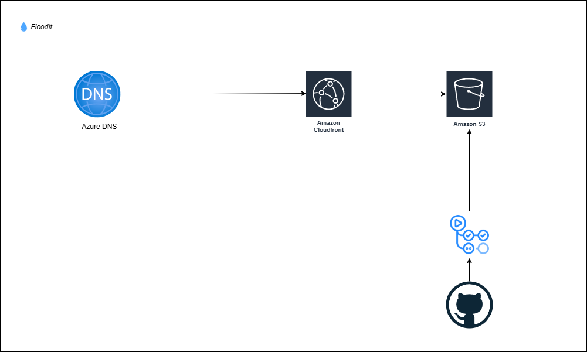

# FloodIt 🌊

A fun and strategic game to test your flood-fill algorithm skills!

## 🌟 Features

-   **Dynamic Grid Generation** ⊞: Every new game brings a unique grid.
-   **Interactive Gameplay** ✨: Click on a grid cell to start flooding with color.
-   **Three Controls**:
    -   💧 **Start**: Begin the flood-filling process from your selected cell.
    -   🔄 **Reset**: Clear the current filled grid while keeping the same layout.
    -   🔀 **Shuffle**: Generate a completely new grid for a fresh challenge.
-   **Live Coordinates Display** 📍: View the row and column of your selected starting cell.
-   **Scores**:
    -   **Current Score** 🚩: The current extent of the flooded area.
    -   **Highest Score** 🏆: Your best score across all games.

## 🎮 How to Play

1. **Choose a Cell** 📍: Click on any non-grayed-out cell to select your starting point. The row and column will display on the UI.
2. **Start Filling** 💧: Hit the `Start` button to flood all connected cells from your starting point.
3. **Reset or Shuffle**:
    - `Reset` clears the flooded grid, letting you try again on the same layout.
    - `Shuffle` generates a brand-new grid layout.
4. **Maximize Your Score**: Strategically select cells to flood as much of the grid as possible without being blocked by grayed-out cells.

## 💡 Strategy Tips

-   Plan ahead! Select starting points that have the largest connected areas.
-   Avoid cells surrounded by gray blocks to maximize your score.
-   Challenge yourself to break your highest score every time!

## 🛠️ Built With

-   **HTML** 🖼️: Structuring the grid and layout.
-   **CSS** 🎨: Styling and colors for a pleasing experience.
-   **JavaScript** ⚙️: Logic for flood-fill, score tracking, and interactivity.

## 🏗️ System Architecture

The system uses a cloud-based deployment pipeline to deliver the game efficiently and reliably.

**Flow Overview**:

-   **Azure DNS** resolves the game’s domain name.
-   **Amazon CloudFront** provides global CDN distribution for faster access.
-   **Amazon S3** hosts the static game files.
-   **GitHub Actions** automates deployment, pushing the latest build into S3.

## 📜 Roadmap

-   [x] Flood-fill logic implementation.
-   [x] Add scoring system.
-   [x] Dynamic grid generation.
-   [ ] Add leaderboard functionality.
-   [ ] Introduce timed challenges for extra difficulty.
